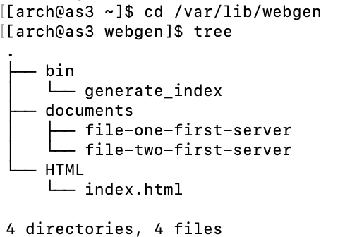

# 2420 as 3 part 2

## Set up two new servers

This part has three main part: create a new user, set up nginx, set up firewall rule, and create load balancer

- nginx: doing serving static content (e.g., HTML, CSS, JS) or act as a reverse proxy for backend servers
- ufw: doing seting up firewall rules, allowing only specific ports while blocking others
- load balancer: improving application performance by increasing response time and reducing network latency 

### Create two new servers on DigitalOcean

1. Create two new droplets on DigitalOcean running Arch Linux the same as previous process
2. Make sure that making droplets with tag "web" - the tag "web" will be used for load balancer

### Create load balancer

1. Make the load balancer with the guideline below

- Type: Regional
- Datacenter: SF03 - same as your new droplets above

2. Keep everything default

- Network Visbility: External(Public)

3. Connect the droplets with the tag "web"

### Create a new user account

Since you have two new servers, you need to do the same steps below on both servers

```bash
sudo useradd -r -m -d /var/lib/webgen -s /usr/bin/nologin webgen
```
- this command line will make a new non-login user
- -r: create a system account
- -m: create the user's home directory
- -d: the new user will be created using HOME_DIR as the value for the user's login directory
- -s: sets the path to the user's login shell

```bash
sudo mkdir -p /var/lib/webgen/bin /var/lib/webgen/HTML /var/lib/webgen/documents
# making three directories same as the provided directory structure
# -p: pass to make the directory if the directory already exists

sudo chown -R webgen:webgen /var/lib/webgen
# change the directory owner and group to webgen
# -R: operate on files and directories recursively
```

In /var/lib/webgen directory, you need to make some files

```bash
sudo touch /var/lib/webgen/HTML/index.html
sudo touch /var/lib/webgen/documents/<file-name1>
sudo touch /var/lib/webgen/documents/<file-name2>
# making the files above
# make sure that you already have the generate_index file in bin directory
```

After you did the steps above, the webgen directory structure with tree command should be the same below



### Set up the service and timer files

```bash
sudo touch /etc/systemd/system/generate-index.service
sudo touch /etc/systemd/system/generate-index.timer
# making the empty files
```

### Set up nginx

```bash
sudo pacman -Syu nginx # install nginx on Arch Linux

sudo mkdir -p /etc/nginx/sites-available # create the directory for server block file
sudo mkdir -p /etc/nginx/sites-enabled

sudo nvim /etc/nginx/sites-available/webgen.conf

sudo ln -s /etc/nginx/sites-available/webgen.conf /etc/nginx/sites-enabled/webgen.conf
# create the symbolic link to enable the configuration
```

In the webgen.conf file, you need to add the text below

```bash
server {
	listen 80;
    
    server_name _;
    
    root /var/lib/webgen/HTML;
    index index.html;

	location / {
		try_files $uri $uri/ =404;
	}

	location /documents {
		root /var/lib/webgen;
		autoindex on; 
		autoindex_exact_size off;
		autoindex_localtime on;
	}
    # error_page sections don't have to be here
    # it can be in nginx.conf http block
	error_page 404 /404.html;
	location = /404.html {
		root /usr/share/nginx/html;
	}

	error_page 500 502 503 504 /50x.html;
	location = /50x.html {
		root /usr/share/nginx/html;
	}
}
```
Since we separates the server block section into /etc/nginx/sites-available/webgen.conf,
you needto check the main nginx.conf file

```bash
include /etc/nginx/sites-enabled/webgen.conf;
# if it's not there, add it to nginx.conf
# make sure this command line should be in http block section
# server block section always be in http block section
# webgen.conf has server block content, so it should in http block
# we made the webgen.conf in sites-available dir, but we also made symlink in sites-enabled dir
# so it should be /etc/nginx/sites-enabled/webgen.conf
```

```bash
sudo nginx -t # test the configuration
sudo systemctl start nginx # start nginx
sudo systemctl status nginx # check nginx status
```

### Set up ufw

```bash
sudo pacman -S ufw # install ufw

# set up a firewall below
sudo ufw default deny incoming # block all incoming connections by default
sudo ufw default allow outgoing # allow all outgoing connections

sudo ufw allow ssh # allow incoming SSH connections (port 22)
sudo ufw limit ssh # limit SSH connections to prevent brute force attacks 
sudo ufw allow http # allow incoming HTTP traffic (port 80)
sudo ufw enable # enable the UFW firewall with the rules above
sudo ufw status verbose # check the status of UFW 
```

#### Answer the question
1. The benefit of creating a system user for this task rather than using a regular user or root.
There are three benefits: enhanced security, separation of concerns and principle of least privilege.

- Enhanced security: since system user has limit privillege, it can reduce the system wide damage.
- Separation of concerns: system user isolates tasks so it makes logs and processes easier to manage.
- Principle of least privilege: system user minimizes the attack surface by having only necessary permissions.

2. Verifying timer, check logs and service execution

```bash
sudo systemctl status generate-index.timer # check timer status
sudo systemctl status generate-index.service # check service status
sudo journalctl -u generate-index.service 
# check logs, use --since or --until; these filter the specific period
```

3. Importance of using separate block file

- Avoiding errors: modifying the main nginx.conf directly increases the risk of breaking entire server
- Ease of management: individual server block files can be enabled or disabled with symbolic links, simplifying maintenance.

4. Check nginx status and test nginx configuration

```bash
sudo systemctl status nginx # check nginx status
sudo nginx -t # test nginx configuration
```

5. Check firewall status
```bash
sudo ufw status verbose # check firewall status
```


